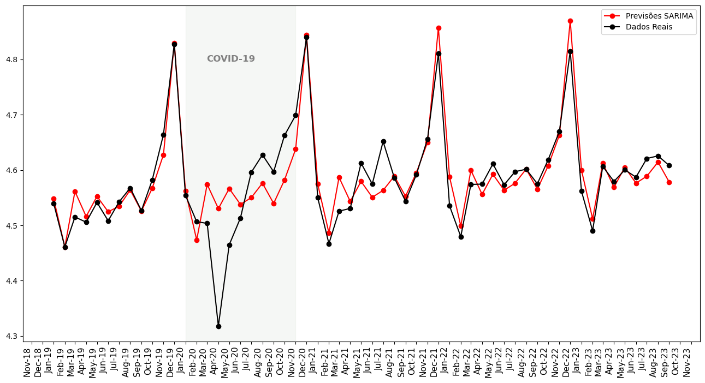

[](https://www.linkedin.com/in/felipe-borges-45400415b/)
[](https://www.python.org/)


# Previsão do Volume de Vendas no Comércio Varejista no Brasil Usando Modelo SARIMA

Este repositório documenta um projeto detalhado de análise de séries temporais, onde foi aplicado métodos estatísticos avançados para prever o volume do comércio varejista no Brasil. Foquei em técnicas de decomposição e diferenciação de séries temporais e na utilização do modelo SARIMA (Seasonal AutoRegressive Integrated Moving Average), reconhecido por sua eficácia em modelar dados com padrões de sazonalidade, tendência e outros comportamentos não-estacionários.



[Link original para o dataset - IBGE](https://www.ibge.gov.br/estatisticas/economicas/comercio/9227-pesquisa-mensal-de-comercio.html?=&t=series-historicas)

<p align="center"> 
  <a href="https://www.linkedin.com/in/felipe-borges-45400415b/" target="_blank"></a> 
</p>

## Desafio Principal
Uma questão crítica deste projeto é a capacidade de adaptar o modelo para acomodar as mudanças drásticas nos padrões de dados decorrentes da pandemia de COVID-19 e os subsequentes períodos de lockdown. Essas mudanças representam um desafio único, pois alteraram significativamente os padrões de consumo e comportamento comercial, exigindo uma abordagem mais sofisticada e adaptativa de modelagem estatística.

## Objetivos 
O foco principal deste projeto é explorar e implementar técnicas de previsão inovadoras, fundamentadas em sólidos conceitos estatísticos, para realizar previsões confiáveis e precisas do Volume de vendas no comércio varejista. Este é um importante indicador da saúde econômica e comercial do país, e a sua previsão precisa é vital para planejamento e tomada de decisões estratégicas.

## Relevância e Aplicabilidade 
Além de fornecer insights sobre o Volume de vendas no comércio varejista, este projeto serve como um estudo de caso para a aplicação de previsões estatísticas em situações de mercado altamente voláteis e imprevisíveis. O sucesso deste projeto será medido não apenas pela precisão das previsões, mas também pela sua capacidade de incorporar e responder a mudanças repentinas no mercado.

## Visão Geral do Projeto

Neste projeto, explorei profundamente os dados de comércio, aplicando uma combinação de análise exploratória e modelagem estatística para prever tendências futuras. A estrutura do projeto é metodicamente organizada nas seguintes fases:

### Importação de Dados
Iniciei com a importação de dados de comércio de um arquivo `.xlsx`, utilizando o pandas para estruturar os dados em um formato apropriado para análise.

### Análise Exploratória de Dados (EDA)
Conduzi uma EDA abrangente para investigar as características fundamentais dos dados. Esta etapa inclui a visualização da série temporal e a realização de análises estatísticas descritivas.

### Pré-processamento de Dados
Nesta fase, preparei os dados para a modelagem. Garanti que as séries temporais estejam em um formato adequado para análise subsequente.

### Construção do Modelo SARIMA
Aqui, selecionei os parâmetros ideais para o modelo SARIMA. Esta escolha é baseada em critérios estatísticos rigorosos, juntamente com diagnósticos de ajuste do modelo, assegurando a adequação do modelo aos dados.

### Avaliação do Modelo
Foi avaliado o desempenho do modelo SARIMA utilizando métricas relevantes. Esta etapa é crucial para validar a precisão das previsões em comparação com os dados reais.

### Visualização das Previsões  
Foi apresentado as previsões do modelo de forma visual, colocando-as ao lado dos dados históricos. Isso oferece uma perspectiva intuitiva e clara do desempenho do modelo.

### Conclusões   
Finalizamos com uma discussão sobre os resultados obtidos, abordando as implicações para estratégias de comércio. Eu propus potenciais melhorias e direções futuras para aprimorar a modelagem, e dar sequencia a esta análise em projetos seguintes.


## Enfoque em Estatística e Técnicas de Decomposição  

Este projeto enfatiza a aplicação de técnicas estatísticas rigorosas para decompor e entender as séries temporais. A decomposição é uma etapa chave, pois permite identificar e separar os diferentes componentes (sazonalidade, tendência, etc.) dos dados de comércio. Essa abordagem aprofundada prepara o terreno para a implementação efetiva do modelo SARIMA, garantindo que nossas previsões sejam tão precisas quanto possível.  

O uso do modelo SARIMA, em particular, destaca nossa habilidade em aplicar métodos estatísticos sofisticados para prever tendências futuras no volume de comércio. Através deste projeto, foi demonstrado como a análise estatística detalhada pode ser aplicada para gerar insights valiosos e informar decisões estratégicas no comércio.  


## Estrutura do repositório

O repositório está estruturado da seguinte forma:

```
├── dados
├── images
├── notebooks

```

- Na pasta `dados` estão os dados utilizados no projeto. O arquivo `DadosdoComercio.xlsx` é o dataset utilizado originalmente. 
- Na pasta `imagens` estão as imagens utilizadas neste README.
- Na pasta `notebooks` estão os notebooks com o desenvolvimento do projeto. Em detalhes, temos:
  - [`projeto_previsao_series_temporais.ipynb`](notebooks/projeto_previsao_series_temporais.ipynb): notebook com o projeto completo
 
